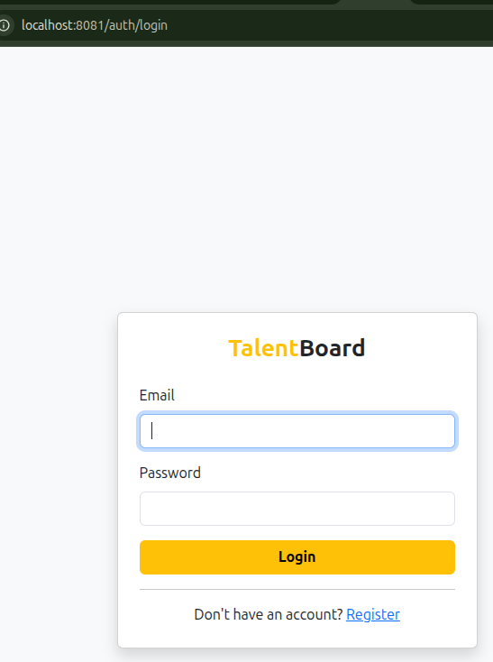
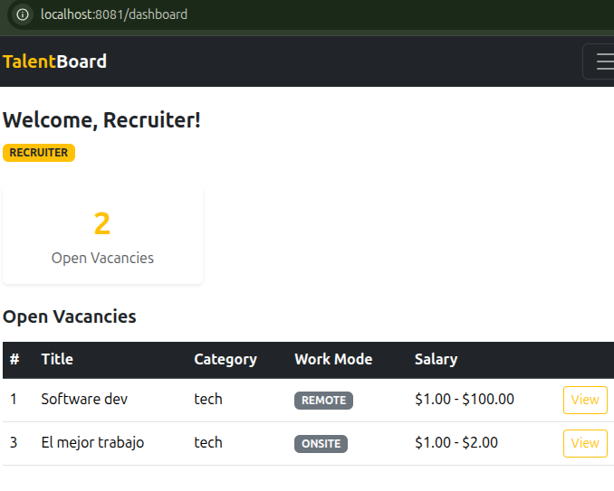
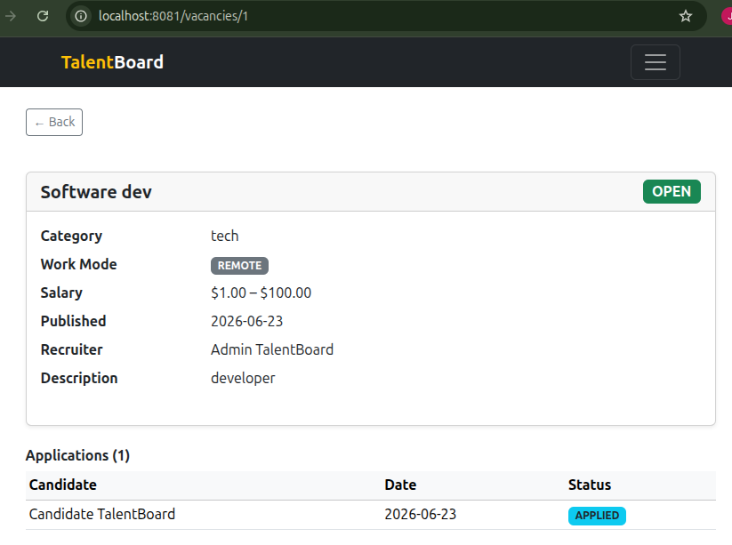
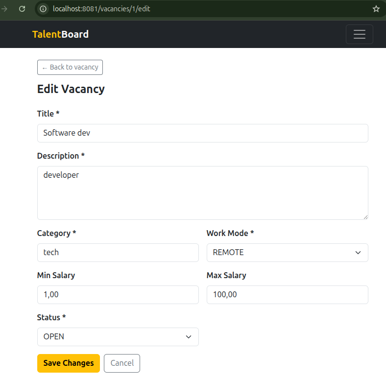
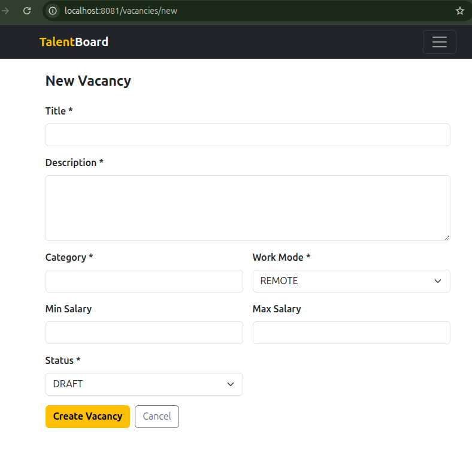

# TalentBoard

Recruitment management platform built with Spring Boot. Centralizes vacancies, candidates, applications, and interviews in a single system, supporting the complete hiring lifecycle from vacancy publication to final decision.

---

## Table of Contents

- [Description](#description)
- [Technologies](#technologies)
- [Architecture](#architecture)
- [Prerequisites](#prerequisites)
- [Environment Variables](#environment-variables)
- [Running with Docker](#running-with-docker)
- [Running Locally](#running-locally)
- [API Documentation](#api-documentation)
- [Test Credentials](#test-credentials)
- [Key Endpoints](#key-endpoints)
- [Business Rules](#business-rules)
- [MapStruct Mappers](#mapstruct-mappers)

---

## Description

TalentBoard solves the problem of managing recruitment processes across disconnected tools (spreadsheets, emails, shared documents). It provides:

- **Vacancy management** — create, update, and close job openings with category, work mode, and salary range
- **Application tracking** — candidates apply to open vacancies; recruiters advance statuses through a defined workflow
- **Interview scheduling** — interviews are linked to applications, dated in the future, and results are recorded
- **Role-based access control** — ADMIN, RECRUITER, and CANDIDATE each see and operate only within their permissions
- **Dual interface** — REST API secured with JWT for integrations, and a Thymeleaf web UI for direct browser access

---

## Technologies

| Layer | Technology | Version |
|-------|-----------|---------|
| Language | Java | 21 |
| Framework | Spring Boot | 3.5.x |
| Security | Spring Security + jjwt | 0.12.6 |
| Persistence | Spring Data JPA + Hibernate | — |
| Database | PostgreSQL | 16 |
| Mapping | MapStruct | 1.5.5.Final |
| Boilerplate | Lombok | — |
| UI | Thymeleaf + Bootstrap | 5.3 |
| API Docs | SpringDoc OpenAPI | 2.5.0 |
| Build | Maven | 3.x |
| Container | Docker + Docker Compose | — |

---

## Architecture

**Package-by-Feature with layered separation inside each feature.**

Each domain (auth, user, vacancy, application, interview) is a self-contained vertical slice. Inside each slice the classic layered pattern applies: `controller → service → repository → entity / dto`.

```
com.talentboard
├── auth/          controller · service · dto
├── user/          controller · service · repository · entity · dto
├── vacancy/       controller · service · repository · entity · dto
├── application/   controller · service · repository · entity · dto
├── interview/     controller · service · repository · entity · dto
├── web/           controller   (Thymeleaf views — separate from REST)
├── common/        exception · mapper · response
├── security/      jwt · filter · service
└── config/        OpenApiConfig · DataInitializer
```

**Security strategy:**

| Surface | Mechanism | Session |
|---------|-----------|---------|
| `/api/**` | JWT Bearer token | Stateless |
| `/**` (UI) | Form login | HTTP Session |

Two `SecurityFilterChain` beans handle each surface independently.

---

## Prerequisites

Recommended: **Docker and Docker Compose** (no local JDK or database required).

Alternative: Java 21 + Maven 3.x + PostgreSQL 16 running on port 5433.

---

## Environment Variables

| Variable | Default | Description |
|----------|---------|-------------|
| `DB_URL` | `jdbc:postgresql://localhost:5433/talentboard` | JDBC connection string |
| `DB_USERNAME` | `talentboard` | Database user |
| `DB_PASSWORD` | `talentboard` | Database password |
| `JWT_SECRET` | `juanito-el-codificador-quiere-hacer-algo-chevere` | JWT signing secret |
| `JWT_EXPIRATION` | `86400000` | Token expiry in milliseconds (24 h) |
| `PORT` | `8081` | Application server port |

All variables have defaults built into `application.properties` so the application runs out of the box with Docker Compose.

---

## Running with Docker

```bash
# 1. Clone the repository
git clone <repository-url>
cd talentboard

# 2. Start all services (app + database)
docker compose up -d

# 3. Verify containers are running
docker compose ps

# 4. Follow application logs
docker compose logs -f talentboard-app

# 5. Stop everything
docker compose down
```

Once running:

| Resource | URL |
|----------|-----|
| Web UI | http://localhost:8081 |
| Swagger UI | http://localhost:8081/swagger-ui.html |
| OpenAPI JSON | http://localhost:8081/api-docs |
| PostgreSQL (host) | localhost:5433 |

> The database runs on host port **5433** (mapped from container port 5432) to avoid conflicts with local PostgreSQL installations.

---

## Running Locally

```bash
# 1. Ensure PostgreSQL 16 is running on port 5433
#    Create database 'talentboard' with user 'talentboard' / password 'talentboard'

# 2. Build (skip tests for first run)
./mvnw clean package -DskipTests

# 3. Run
java -jar target/talentboard-0.0.1-SNAPSHOT.jar

# Or directly with Maven
./mvnw spring-boot:run
```

---

## API Documentation

Swagger UI is available once the application is running:

```
http://localhost:8081/swagger-ui.html
```

All protected endpoints require the `Authorization: Bearer <token>` header. Obtain a token via:

```http
POST /api/auth/login
Content-Type: application/json

{
  "email": "recruiter@talentboard.com",
  "password": "recruiter123"
}
```

---

## Test Credentials

These users are automatically seeded on every application startup via `DataInitializer`.

| Role | Email | Password |
|------|-------|----------|
| ADMIN | admin@talentboard.com | admin123 |
| RECRUITER | recruiter@talentboard.com | recruiter123 |
| CANDIDATE | candidate@talentboard.com | candidate123 |

---

## Key Endpoints

### Authentication (public)

| Method | Path | Description |
|--------|------|-------------|
| POST | `/api/auth/register` | Register a new user |
| POST | `/api/auth/login` | Login — returns JWT token |

### Vacancies

| Method | Path | Role |
|--------|------|------|
| GET | `/api/vacancies/public` | Public |
| GET | `/api/vacancies` | ADMIN, RECRUITER |
| GET | `/api/vacancies/{id}` | Authenticated |
| POST | `/api/vacancies` | ADMIN, RECRUITER |
| PUT | `/api/vacancies/{id}` | Owner / ADMIN |
| PATCH | `/api/vacancies/{id}/status?status=OPEN` | Owner / ADMIN |
| DELETE | `/api/vacancies/{id}` | Owner / ADMIN |

### Applications

| Method | Path | Role |
|--------|------|------|
| GET | `/api/applications` | ADMIN |
| GET | `/api/applications/my` | CANDIDATE |
| GET | `/api/applications/vacancy/{vacancyId}` | RECRUITER, ADMIN |
| POST | `/api/applications` | CANDIDATE |
| PATCH | `/api/applications/{id}/status` | RECRUITER, ADMIN |

### Interviews

| Method | Path | Role |
|--------|------|------|
| GET | `/api/interviews/application/{id}` | RECRUITER, ADMIN |
| GET | `/api/interviews/my` | CANDIDATE |
| POST | `/api/interviews` | RECRUITER, ADMIN |
| PATCH | `/api/interviews/{id}/result?result=PASSED` | RECRUITER, ADMIN |

### Users (Admin only)

| Method | Path | Description |
|--------|------|-------------|
| GET | `/api/users` | List all users |
| GET | `/api/users/{id}` | Get user by ID |
| PUT | `/api/users/{id}` | Update names |
| PATCH | `/api/users/{id}/toggle` | Enable / disable user |
| DELETE | `/api/users/{id}` | Delete user |

---

## Business Rules

| Rule | HTTP Response |
|------|--------------|
| Candidate applies twice to same vacancy | `409 Conflict` |
| Application to a non-OPEN vacancy | `409 Conflict` |
| Interview date in the past | `400 Bad Request` (validation) |
| Candidate accesses another candidate's data | `403 Forbidden` |
| Recruiter modifies another recruiter's vacancy | `403 Forbidden` |
| Invalid credentials on login | `401 Unauthorized` |

---

## Application Status Flow

```
APPLIED
  └─► UNDER_REVIEW
        ├─► INTERVIEW_SCHEDULED
        │     └─► INTERVIEW_COMPLETED
        ├─► TECHNICAL_TEST
        ├─► OFFERED
        │     └─► HIRED
        └─► REJECTED
```

---

## MapStruct Mappers

All entity ↔ DTO conversions are handled by MapStruct (compile-time code generation — no reflection at runtime):

| Mapper | Responsibility |
|--------|---------------|
| `UserMapper` | `User ↔ UserRegistrationRequest / UserResponse` |
| `VacancyMapper` | `Vacancy ↔ VacancyRequest / VacancyResponse` + in-place `updateEntity` |
| `ApplicationMapper` | `Application ↔ ApplicationRequest / ApplicationResponse` |
| `InterviewMapper` | `Interview ↔ InterviewRequest / InterviewResponse` |

Nested fields are flattened via explicit `@Mapping` annotations, for example:

```java
@Mapping(source = "recruiter.firstName", target = "recruiterFirstName")
@Mapping(source = "recruiter.id",        target = "recruiterId")
VacancyResponse toResponse(Vacancy vacancy);
```




